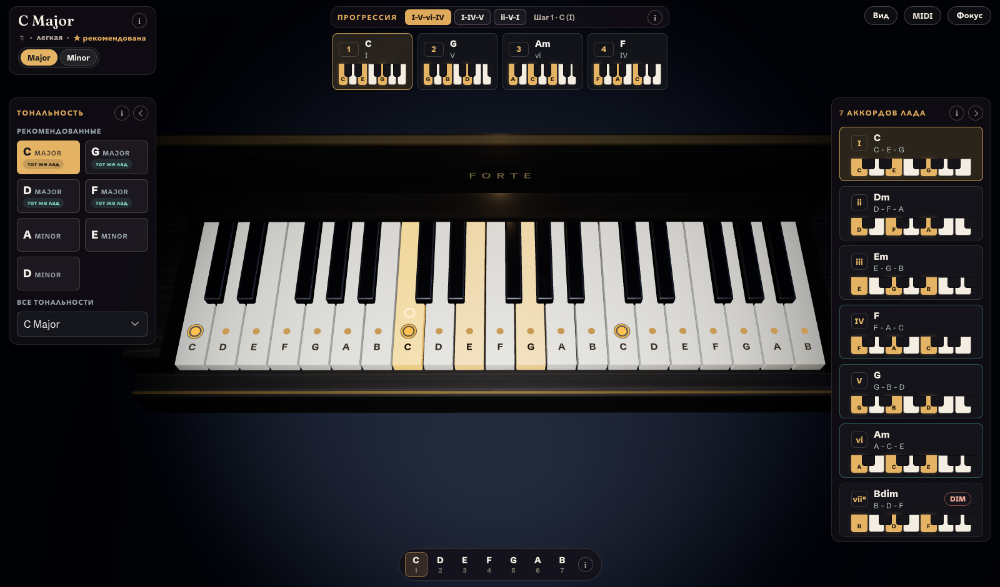
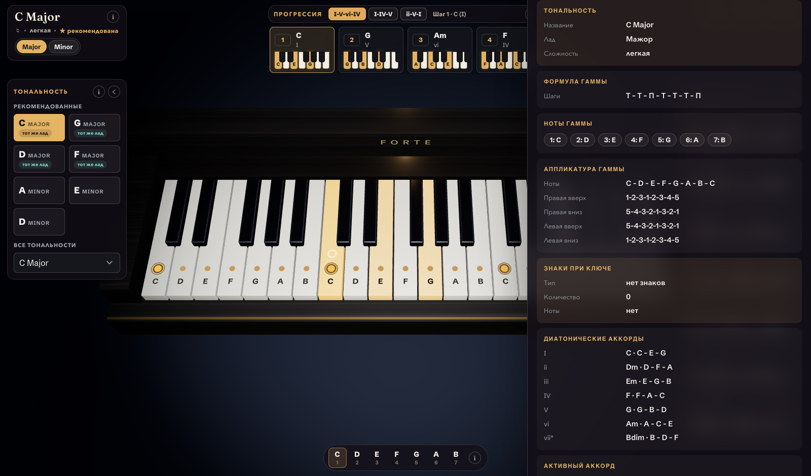
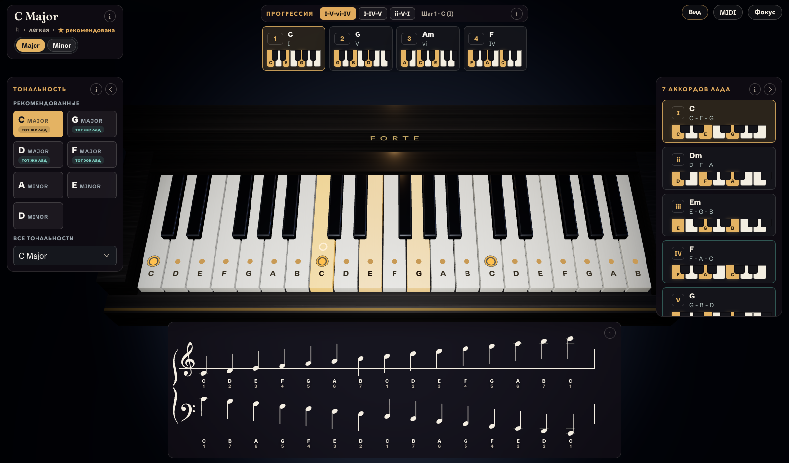
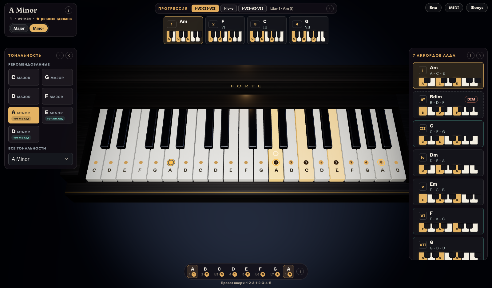

# Forte

Интерактивный справочник по фортепианной импровизации с 3D-клавиатурой. Приложение показывает гаммы, диатонические аккорды и прогрессии в выбранной тональности, подсвечивает ноты прямо на объёмной клавиатуре и поддерживает подключение MIDI-клавиатуры.

## Обзор



<table>
  <tr>
    <td width="33%" valign="top">
      
      <br /><sub><b>Теоретический оверлей</b> — формула гаммы, аппликатура, знаки при ключе и диатонические аккорды.</sub>
    </td>
    <td width="33%" valign="top">
      
      <br /><sub><b>Нотный стан</b> — гамма на большом стане (VexFlow) с названиями нот, ступенями и аппликатурой.</sub>
    </td>
    <td width="33%" valign="top">
      
      <br /><sub><b>Аппликатура на клавишах</b> — минорный лад с подсказками аппликатуры прямо на 3D-клавиатуре.</sub>
    </td>
  </tr>
</table>

## Возможности

- **Тональности и лады.** Выбор тоники и лада (мажор / натуральный минор) с подсказками рекомендованных тональностей и знаков при ключе.
- **3D-клавиатура.** Сцена на React Three Fiber подсвечивает ноты гаммы, тонику, активный аккорд и нажатые MIDI-клавиши.
- **Аккорды и прогрессии.** Диатонические аккорды лада и пресеты прогрессий (например `I-V-vi-IV`, `ii-V-I`) с пошаговым выбором.
- **Аппликатура гамм.** Отображение аппликатуры для левой и правой руки в восходящем и нисходящем движении.
- **Нотный стан.** Альтернативный вид гаммы в виде нотной записи (скрипичный и басовый ключи) на базе VexFlow.
- **MIDI-вход.** Подключение MIDI-клавиатуры через Web MIDI: нажатые ноты подсвечиваются в реальном времени.
- **Теоретический оверлей.** Контекстные пояснения по тональности, гамме, аккордам и прогрессии.
- **Адаптивный интерфейс.** Раскладки для desktop, планшета и мобильного, режим фокуса и сохранение настроек в `localStorage`.

## Технологии

- [Vite](https://vitejs.dev/), [React 19](https://react.dev/) и [TypeScript](https://www.typescriptlang.org/)
- [Zustand](https://github.com/pmndrs/zustand) — управление состоянием
- [React Three Fiber](https://r3f.docs.pmnd.rs/) и [three.js](https://threejs.org/) — 3D-сцена
- [VexFlow](https://www.vexflow.com/) — нотная запись
- [Web MIDI](https://developer.mozilla.org/docs/Web/API/Web_MIDI_API) — ввод с MIDI-клавиатуры
- [Vitest](https://vitest.dev/) и [Testing Library](https://testing-library.com/) — тесты

## Начало работы

Требуется Node.js 18+ и npm.

```bash
npm install
npm run dev
```

Dev-сервер Vite откроется на `http://localhost:5173`.

## Команды

| Команда                 | Описание                                        |
| ----------------------- | ----------------------------------------------- |
| `npm run dev`           | Запуск dev-сервера Vite.                         |
| `npm run build`         | Сборка production (`tsc -b` + Vite build).       |
| `npm run preview`       | Локальный просмотр production-сборки.            |
| `npm run test`          | Запуск набора тестов Vitest.                     |
| `npm run test:coverage` | Тесты с покрытием V8.                            |
| `npm run typecheck`     | Проверка типов без сборки ассетов.               |
| `npm run lint`          | Запуск ESLint по репозиторию.                    |

## Структура проекта

```
src/
├── music/    музыкальная теория: гаммы, аккорды, прогрессии, тональности, аппликатура
├── state/    состояние Zustand и селекторы view-моделей
├── scene/    3D-сцена на React Three Fiber / three.js
├── midi/      клиент Web MIDI и контроллер ввода
├── ui/        HUD и примитивные компоненты
└── styles/    общие CSS-стили
```

Музыкальная логика сосредоточена в `src/music`; UI и 3D-сцена рендерят готовые view-модели и не дублируют теорию. Тесты лежат рядом с кодом в каталогах `__tests__`. Заметки по реализации находятся в `spec`.

## MIDI

Web MIDI работает в браузерах на Chromium (Chrome, Edge) по защищённому соединению (`https` или `localhost`). Подключите устройство, откройте панель MIDI и выдайте разрешение на доступ — нажатые ноты сразу появятся на 3D-клавиатуре.
