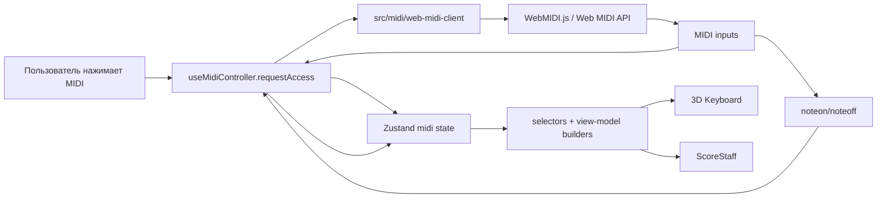

# MIDI-ввод через WebMIDI.js — ТЗ для реализации

## 1. Цель

Добавить в Forte Piano Improvisation опциональное подключение MIDI-клавиатуры через браузерный Web MIDI API и библиотеку `webmidi`.

Пользователь должен подключать MIDI input из браузера, нажимать клавиши на физической MIDI-клавиатуре и видеть live-подсветку фактически нажатых нот:

- на 3D-клавиатуре приложения;
- на нотном стане, если выбран режим `Импровизация` или `Практика` и соответствующая нота уже есть в текущей модели стана.

Первая версия работает со стандартным browser MIDI input, который операционная система уже видит как MIDI-устройство. Bluetooth MIDI pairing выполняется на уровне ОС. Прямое BLE-подключение через Web Bluetooth API не входит в первую версию.

## 2. Как выполнять это ТЗ

### Область работ

- Runtime dependency `webmidi` в `package.json` и `package-lock.json`.
- Новый MIDI adapter/lifecycle слой в `src/midi/**`.
- Session-only MIDI state и actions в `src/state/app-state.ts`.
- Selectors/view-model enrichment в `src/state/selectors.ts` и `src/music/view-models.ts`.
- Доменные типы активных MIDI-нот и highlight layers в `src/music/types.ts` или соседних доменных модулях.
- Маппинг `MIDI note number -> physicalPitchClass + octave` без зависимости от браузерных API.
- Подсветка `midiPressed` в `src/scene/PianoKey3D.tsx`, `src/scene/PianoKeyboard3D.tsx`, `src/ui/hud/ScoreStaff.tsx`, CSS и color legend.
- MIDI UI для desktop и compact layout в `src/app/AppShell.tsx`, `src/ui/hud/TopHud.tsx` и новых HUD-компонентах при необходимости.
- Unit/component tests в существующих `__tests__` и новых `src/midi/__tests__`/`src/music/__tests__` при необходимости.
- Обновление `README.md`: MVP больше не должен утверждать, что MIDI-ввода нет.
- Технический журнал `spec/midi-input-integration-log.md`.

### Вне области работ

- Прямой BLE-MIDI driver через Web Bluetooth API.
- Pairing Bluetooth-устройства внутри приложения.
- Web MIDI polyfills, Jazz-Plugin, Safari fallback и поддержка браузеров без нативного Web MIDI API.
- MIDI output, sound generation, Web Audio, сэмплы, синтезатор, mute/volume и latency tuning.
- SysEx; `WebMidi.enable({ sysex: true })` не использовать.
- Режим `All inputs`; первая версия слушает один выбранный MIDI input.
- Запись исполнения, live transcription, проверка правильности игры, метроном и упражнения.
- Добавление на нотный стан внегаммовых или новых сыгранных нот.
- Расширение диапазона 3D-клавиатуры, скролл клавиатуры или выбор стартовой октавы.
- Persistence выбранного MIDI input между перезагрузками страницы.
- Backend, routing, аккаунты и синхронизация между вкладками.
- Редактирование вручную сгенерированных `dist` и `coverage`.

### Предусловия и зависимости

- Использовать npm; lock-файл проекта — `package-lock.json`.
- Установить `webmidi` через `npm install webmidi`, чтобы обновился lock-файл.
- Браузерная MIDI-интеграция должна запускаться только в secure context: `https://`, `localhost` или другой origin, который браузер считает безопасным.
- Первый запрос доступа к MIDI должен происходить по пользовательскому действию, например по нажатию кнопки `MIDI`.
- Bluetooth MIDI-клавиатура должна быть заранее подключена в ОС и отображаться как MIDI input. Приложение только выбирает input, который уже виден Web MIDI API.
- Тесты не должны требовать реального MIDI-устройства, browser permission prompt или настоящего `navigator.requestMIDIAccess()`.

### Исходные внешние контракты

- WebMIDI.js поддерживает браузеры с нативным Web MIDI API и TypeScript definitions начиная с v3: <https://webmidijs.org/docs/getting-started/>
- Установка npm-пакета: `npm install webmidi`; ESM import: `import { WebMidi } from "webmidi"`: <https://webmidijs.org/docs/getting-started/installation/>
- Базовый lifecycle: `WebMidi.enable()`, `WebMidi.inputs`, `getInputById()`, `Input.addListener("noteon" | "noteoff", ...)`, `removeListener()`: <https://webmidijs.org/docs/getting-started/basics/>
- Middle C convention: WebMIDI.js по умолчанию считает MIDI note `60` как `C4`: <https://webmidijs.org/docs/going-further/middle-c/>
- Web MIDI API требует secure context и пользовательское/permission-policy разрешение: <https://developer.mozilla.org/en-US/docs/Web/API/Web_MIDI_API>

### Термины

- `MIDI input` — входной порт из Web MIDI API/WebMIDI.js.
- `MIDI note number` — числовая MIDI-нота `0..127`; `60` соответствует `C4`.
- `active MIDI note` — нота с полученным `noteon velocity > 0`, для которой еще не пришел `noteoff` или `noteon velocity = 0`.
- `midiPressed` — отдельный visual highlight layer фактического нажатия MIDI-клавиши.
- `visible keyboard range` — текущие клавиши в `KeyboardViewModel`: desktop/tablet `C3..B5`, mobile `C3..B4`, если `startOctave` и `octaveCount` не изменены текущей моделью.

### Общие инварианты

- MIDI-ввод является optional capability. `unsupported`, `permissionDenied`, `noInputs`, `error` и отключение устройства не должны ломать справочник.
- Состояние MIDI хранится только в памяти текущей вкладки и сбрасывается при reload.
- В Zustand нельзя хранить объекты `WebMidi`, `Input`, listeners, DOM handles или browser permission objects.
- `src/midi/**` владеет импортом `webmidi`; `src/music/**`, scene и HUD не импортируют `webmidi`.
- Пользователь выбирает один активный MIDI input. При выборе нового input listeners снимаются со старого, активные ноты очищаются.
- Если после `enable()` найден ровно один input, приложение выбирает его автоматически.
- Если inputs несколько, UI показывает список и ждет явного выбора.
- Если inputs нет, статус становится `noInputs`, активные ноты очищаются.
- При отключении выбранного input активные ноты очищаются, выбранный input сбрасывается, UI показывает сообщение об отключении.
- `noteon velocity > 0` добавляет/обновляет активную ноту.
- `noteoff` удаляет активную ноту.
- `noteon velocity = 0` эквивалентен `noteoff`.
- `velocity` хранится как raw integer `1..127` для активных нот. Визуальная яркость в первой версии не зависит от velocity.
- MIDI-подсветка не меняет выбранную тональность, лад, прогрессию, активный аккорд, режим стана, подписи или аппликатуру.
- MIDI-подсветка независима от `chordLayerEnabled`: режим `Только гамма` скрывает только слой активного аккорда, но не скрывает `midiPressed`.
- На 3D-клавиатуре подсвечивается точная клавиша по `physicalPitchClass + octave`, а не все pitch-class совпадения.
- На нотном стане подсвечивается только уже существующая нота модели с тем же `physicalPitchClass + octave`. Новые ноты на стан не добавляются.
- Если сыгранная MIDI-нота вне видимого диапазона клавиатуры, 3D-клавиатура ее не подсвечивает.
- Если сыгранная MIDI-нота не входит в текущую модель нотного стана, нотный стан ее не подсвечивает.
- `midiPressed` визуально приоритетнее `inScale`, `tonic`, `activeChord` и `diminished`.
- Цвет `midiPressed` должен быть холодным cyan/blue, отличимым от теплой янтарной теоретической подсветки.

### Модель статусов

Целевые статусы MIDI:

```ts
export type MidiConnectionStatus =
  | 'idle'
  | 'requesting'
  | 'ready'
  | 'connected'
  | 'noInputs'
  | 'unsupported'
  | 'permissionDenied'
  | 'disconnected'
  | 'error';
```

- `idle`: пользователь еще не запрашивал MIDI-доступ.
- `requesting`: идет `WebMidi.enable()` или обновление доступных inputs.
- `ready`: MIDI-доступ включен, inputs есть, но выбранный input отсутствует.
- `connected`: выбранный input слушается.
- `noInputs`: Web MIDI включен, но input-устройств нет.
- `unsupported`: Web MIDI API недоступен или WebMIDI.js не может работать в текущем браузере/origin.
- `permissionDenied`: пользователь, браузер или permission policy запретили MIDI-доступ.
- `disconnected`: ранее выбранный input исчез или был отключен.
- `error`: непредвиденная ошибка adapter/controller.

`disconnected` добавлен как отдельный статус, потому что UI должен явно показывать состояние "Устройство отключено". Если реализация выбирает `ready` с reason/message вместо отдельного статуса, observable UI, очистка active notes и tests должны остаться эквивалентными.

### Матрица проверок

- Изменение dependency: `npm install webmidi`, затем `npm run typecheck`.
- Изменение MIDI adapter/controller: focused tests с mock WebMIDI client, затем `npm run test`.
- Изменение state/actions/selectors: state selector tests, затем `npm run test` и `npm run typecheck`.
- Изменение `src/music` mapping/view-models: unit tests в `src/music/__tests__` и `src/state/__tests__`.
- Изменение 3D/ScoreStaff rendering: component tests и browser verification desktop/mobile.
- Изменение CSS/layout: `npm run lint`, `git diff --check`, browser screenshot verification.
- Финальный gate: `npm run test`, `npm run typecheck`, `npm run lint`, `npm run build`, `git diff --check`.

## 3. Целевой public API

### Dependency

`package.json` должен получить runtime dependency:

```json
"webmidi": "<npm-resolved-version>"
```

Версию фиксировать через `npm install webmidi`; не редактировать lock-файл вручную.

### Music/domain types

Добавить или уточнить доменные типы без импорта `webmidi`:

```ts
export type MidiNoteNumber = number;

export interface MidiPressedNote {
  readonly midiNoteNumber: MidiNoteNumber;
  readonly physicalPitchClass: PhysicalPitchClass;
  readonly octave: number;
  readonly velocity: number;
}

export type KeyboardHighlightLayer =
  | 'inScale'
  | 'tonic'
  | 'activeChord'
  | 'diminished'
  | 'midiPressed';

export type StaffHighlightLayer = 'activeChord' | 'midiPressed';
```

`StaffNoteViewModel` должен различать причины подсветки. Целевой вариант:

```ts
export interface StaffNoteViewModel {
  readonly id: string;
  readonly noteName: NoteName;
  readonly degree: ScaleDegree;
  readonly degreeLabel: DegreeLabel;
  readonly physicalPitchClass: PhysicalPitchClass;
  readonly octave: number;
  readonly clef: StaffClef;
  readonly slotIndex: number;
  readonly highlightLayers: readonly StaffHighlightLayer[];
  readonly finger: PianoFinger | null;
}
```

Если ради минимального diff временно сохраняется `highlighted: boolean`, финальный cleanup должен убрать двусмысленность или явно переименовать active-chord flag. Renderer не должен выводить MIDI через старый boolean `highlighted`.

### MIDI adapter types

Создать `src/midi/types.ts`:

```ts
import type { MidiNoteNumber } from '../music/types';

export type MidiConnectionStatus =
  | 'idle'
  | 'requesting'
  | 'ready'
  | 'connected'
  | 'noInputs'
  | 'unsupported'
  | 'permissionDenied'
  | 'disconnected'
  | 'error';

export interface MidiInputDevice {
  readonly id: string;
  readonly name: string;
  readonly manufacturer: string | null;
  readonly connected: boolean;
}

export interface MidiNoteInputEvent {
  readonly midiNoteNumber: MidiNoteNumber;
  readonly velocity: number;
}

export interface MidiInputListeners {
  readonly noteOn: (event: MidiNoteInputEvent) => void;
  readonly noteOff: (event: MidiNoteInputEvent) => void;
  readonly inputsChanged: (inputs: readonly MidiInputDevice[]) => void;
  readonly inputDisconnected: (inputId: string) => void;
  readonly error: (message: string) => void;
}
```

Допустимо уточнить имена, но adapter boundary должен оставаться явным: наружу выходят только plain objects и callbacks, не `webmidi` instances.

### MIDI client contract

Создать adapter, например `src/midi/web-midi-client.ts`, с контрактом уровня приложения:

```ts
export interface MidiClient {
  readonly isSupported: () => boolean;
  readonly enable: () => Promise<readonly MidiInputDevice[]>;
  readonly listInputs: () => readonly MidiInputDevice[];
  readonly listenToInput: (inputId: string, listeners: MidiInputListeners) => void;
  readonly stopListening: () => void;
  readonly disable: () => void;
}
```

Требования:

- `enable()` вызывает `WebMidi.enable()` без `sysex`.
- `listInputs()` возвращает только input ports.
- `listenToInput()` снимает предыдущие note listeners перед установкой новых.
- `stopListening()` безопасен при отсутствии выбранного input.
- `disable()` снимает listeners и вызывает соответствующий cleanup WebMIDI.js, если он доступен.
- Ошибки WebMIDI.js нормализуются в status-level messages без проброса library-specific объектов в UI/state.

### State API

`AppState` должен получить session-only MIDI state. Целевой вариант:

```ts
export interface MidiRuntimeState {
  readonly status: MidiConnectionStatus;
  readonly inputs: readonly MidiInputDevice[];
  readonly selectedInputId: string | null;
  readonly activeNotes: readonly MidiPressedNote[];
  readonly errorMessage: string | null;
}

export interface AppState {
  readonly midi: MidiRuntimeState;
}
```

Начальное значение:

```ts
midi: {
  status: 'idle',
  inputs: [],
  selectedInputId: null,
  activeNotes: [],
  errorMessage: null
}
```

`AppActions` должен получить actions для controller adapter. Минимальный контракт:

```ts
readonly setMidiRequesting: () => void;
readonly setMidiReady: (inputs: readonly MidiInputDevice[]) => void;
readonly setMidiConnected: (inputId: string, inputs: readonly MidiInputDevice[]) => void;
readonly setMidiNoInputs: () => void;
readonly setMidiUnsupported: (message: string) => void;
readonly setMidiPermissionDenied: (message: string) => void;
readonly setMidiDisconnected: (message: string, inputs: readonly MidiInputDevice[]) => void;
readonly setMidiError: (message: string) => void;
readonly setMidiInputs: (inputs: readonly MidiInputDevice[]) => void;
readonly disconnectMidiInput: () => void;
readonly pressMidiNote: (note: MidiPressedNote) => void;
readonly releaseMidiNote: (midiNoteNumber: MidiNoteNumber) => void;
readonly clearMidiNotes: () => void;
```

Validation requirements:

- `pressMidiNote` rejects non-integer note numbers outside `0..127`.
- `pressMidiNote` rejects velocity outside raw `1..127`.
- `releaseMidiNote` rejects non-integer note numbers outside `0..127`.
- Pressing an already active note updates its velocity instead of duplicating it.
- `disconnectMidiInput`, status transitions away from `connected`, input switch and errors clear `activeNotes`.

### Controller hook

Создать thin lifecycle hook, например `src/midi/useMidiController.ts`:

```ts
export interface MidiController {
  readonly requestAccess: () => Promise<void>;
  readonly selectInput: (inputId: string) => void;
  readonly disconnect: () => void;
}
```

Hook должен:

- создавать/получать один `MidiClient` instance;
- связывать adapter callbacks с Zustand actions;
- запускать `requestAccess()` только из UI action;
- авто-выбирать единственный input после successful enable;
- очищать listeners при unmount;
- не импортироваться из `src/music/**`.

### Selectors/view models

Обновить существующие selectors:

```ts
export function selectKeyboardViewModel(
  state: AppState,
  viewport: KeyboardViewport
): KeyboardViewModel;

export function selectScoreStaffViewModel(
  state: AppState,
  viewport: KeyboardViewport
): ScoreStaffViewModel | null;

export function selectColorLegend(state: AppState): readonly ColorLegendItem[];
```

Контракт:

- `selectKeyboardViewModel` передает активные MIDI-ноты в `createKeyboardViewModel`.
- `createKeyboardViewModel` добавляет `midiPressed` только точной клавише с совпадающим `physicalPitchClass + octave`.
- `selectScoreStaffViewModel` передает активные MIDI-ноты в `createScoreStaffViewModel`.
- `createScoreStaffViewModel` добавляет `midiPressed` только существующей staff note с тем же `physicalPitchClass + octave`.
- `selectColorLegend` добавляет item `midiPressed` с label `Нажато на MIDI` и описанием фактического нажатия с физической MIDI-клавиатуры.

## 4. Целевая архитектура

- `src/midi/web-midi-client.ts` — единственный владелец `import { WebMidi } from 'webmidi'`.
- `src/midi/useMidiController.ts` — lifecycle bridge между adapter и Zustand.
- `src/midi/types.ts` — browser-adapter типы plain objects.
- `src/music/midi-notes.ts` или соседний domain-модуль — чистые функции `toMidiPressedNote`, `getMidiNoteIdentity`, validation note number/velocity.
- `src/music/view-models.ts` — добавление `midiPressed` в keyboard/staff view models.
- `src/state/app-state.ts` — session-only MIDI state/actions.
- `src/state/selectors.ts` — передача active MIDI notes в view-model builders и legend.
- `src/ui/hud/MidiPanel.tsx` или equivalent — UI статуса, выбора input и отключения.
- `src/app/AppShell.tsx` — размещение MIDI entry point на desktop и compact layout.
- `src/scene/PianoKey3D.tsx` — visual pressed/glow state для `midiPressed`.
- `src/ui/hud/ScoreStaff.tsx` — visual note/label style для `midiPressed`.

Основной поток:



Запрещенные связи:

- `src/music/** -> src/midi/**`
- `src/scene/** -> webmidi`
- `src/ui/** -> webmidi`
- Zustand state -> `WebMidi`/`Input` object references

## 5. Этапы реализации

### Этап 1 — Зависимость, типы и session state

#### Цель

Добавить `webmidi`, определить целевые типы и session-only state/actions без включения реального MIDI lifecycle.

#### Зависит от

Нет.

#### Контракт этапа

- Выполнить `npm install webmidi`.
- Добавить `src/midi/types.ts` с plain-object типами adapter layer.
- Добавить `MidiNoteNumber`, `MidiPressedNote`, `StaffHighlightLayer` и `midiPressed` в `KeyboardHighlightLayer`.
- Добавить `midi: MidiRuntimeState` в `createInitialAppState`.
- Добавить MIDI actions из раздела State API или эквивалентные по контракту.
- Реализовать validation для note number `0..127` и raw velocity `1..127`.
- `pressMidiNote` должен заменять существующую active note с тем же `midiNoteNumber`.
- Все status transitions, которые отключают input или делают input неизвестным, должны очищать `activeNotes`.
- Не менять UI и не импортировать `webmidi` за пределами будущего adapter-файла.

#### Не делать в этом этапе

- Не вызывать `WebMidi.enable()`.
- Не создавать React hook/controller.
- Не менять 3D-клавиатуру и нотный стан.
- Не добавлять кнопку `MIDI`.
- Не обновлять README до появления behavior.

#### Тесты этапа

- `src/state/__tests__/state-selectors.test.ts` или отдельный state test:
  - initial `midi.status === 'idle'`;
  - initial `midi.activeNotes` пустой;
  - press/release active note;
  - repeated press updates velocity without duplicate;
  - status disconnect/error clears notes;
  - invalid note number/velocity throws readable error.
- `npm run test`.
- `npm run typecheck`.

#### Критерий завершения

- `webmidi` установлен через npm и lock-файл обновлен.
- State/actions покрыты tests.
- В diff нет runtime WebMIDI lifecycle.
- `npm run test` и `npm run typecheck` проходят.

### Этап 2 — Чистый MIDI note mapping

#### Цель

Добавить чистый domain mapping `MIDI note number -> physicalPitchClass + octave` и подготовить данные для view-model подсветки.

#### Зависит от

Этап 1.

#### Контракт этапа

- Создать `src/music/midi-notes.ts` или соседний domain-модуль.
- Реализовать mapping:
  - `physicalPitchClass = midiNoteNumber % 12`;
  - `octave = Math.floor(midiNoteNumber / 12) - 1`;
  - `48 -> C3`;
  - `60 -> C4`;
  - `72 -> C5`.
- Реализовать `createMidiPressedNote({ midiNoteNumber, velocity })`.
- Validation должна быть общей с state actions или иметь одного явного владельца.
- Mapping не должен использовать note spelling выбранной тональности.
- Mapping не должен импортировать `webmidi`.
- Velocity остается raw integer `1..127`; визуальная логика не зависит от него.

#### Не делать в этом этапе

- Не добавлять подсветку в view models.
- Не менять UI.
- Не вызывать Web MIDI API.

#### Тесты этапа

- `src/music/__tests__/midi-notes.test.ts`:
  - `48 -> { physicalPitchClass: 0, octave: 3 }`;
  - `60 -> { physicalPitchClass: 0, octave: 4 }`;
  - `72 -> { physicalPitchClass: 0, octave: 5 }`;
  - black keys map to expected pitch classes;
  - invalid note numbers and velocity values throw readable errors.
- `npm run test`.
- `npm run typecheck`.

#### Критерий завершения

- Mapping is deterministic and covered by tests.
- Domain module has no browser or WebMIDI.js imports.
- State actions use the same validation/mapping owner or a clearly documented wrapper.

### Этап 3 — WebMIDI.js adapter и controller lifecycle

#### Цель

Изолировать WebMIDI.js в adapter layer и связать lifecycle с Zustand через тонкий hook.

#### Зависит от

Этапы 1-2.

#### Контракт этапа

- Создать `src/midi/web-midi-client.ts`.
- `web-midi-client.ts` — единственный файл с `import { WebMidi } from 'webmidi'`.
- `isSupported()` должен проверять доступность Web MIDI API до вызова `enable()`, насколько это возможно в браузере.
- `enable()` вызывает `WebMidi.enable()` без `sysex`.
- После `enable()` adapter возвращает актуальный список `WebMidi.inputs`.
- Adapter нормализует input в `{ id, name, manufacturer, connected }`.
- `listenToInput(inputId, listeners)`:
  - ищет input по id;
  - снимает предыдущие listeners;
  - подписывается на `noteon` и `noteoff` на уровне input, без выбора channel;
  - слушает все MIDI channels;
  - нормализует note number и raw velocity;
  - трактует `noteon velocity = 0` как `noteOff`.
- Adapter должен обрабатывать изменение списка devices, если WebMIDI.js exposes соответствующее событие. Если API отличается, fallback: обновлять список после `enable()` и при пользовательском повторном запросе.
- `stopListening()` снимает note listeners и не бросает при повторном вызове.
- `disable()` вызывает `stopListening()` и отключает WebMIDI.js, если библиотека предоставляет safe disable.
- Ошибки permission denied должны мапиться в `permissionDenied`; неподдержанный API — в `unsupported`; остальные — в `error`.
- Создать `src/midi/useMidiController.ts`.
- `requestAccess()`:
  - переводит state в `requesting`;
  - вызывает `client.enable()`;
  - при `0` inputs ставит `noInputs`;
  - при `1` input авто-выбирает и запускает listening;
  - при `>1` inputs ставит `ready`;
  - не дублирует listeners при повторном вызове.
- `selectInput(inputId)`:
  - снимает старые listeners;
  - очищает active notes;
  - выбирает новый input;
  - переводит state в `connected`.
- `disconnect()`:
  - снимает listeners;
  - очищает active notes;
  - сбрасывает `selectedInputId`;
  - оставляет status `ready`, если inputs есть, иначе `noInputs`.
- Hook cleanup on unmount вызывает `stopListening()` и очищает active notes.

#### Не делать в этом этапе

- Не добавлять visual highlights.
- Не добавлять production UI, кроме test harness при необходимости.
- Не добавлять persistence.
- Не слушать MIDI outputs.
- Не включать SysEx.

#### Тесты этапа

- Tests с fake `MidiClient`:
  - `requestAccess` maps unsupported/permission/noInputs/errors;
  - один input auto-connects;
  - несколько inputs оставляют status `ready`;
  - `selectInput` очищает старые notes и подключает новый input;
  - `disconnect` снимает listeners и очищает notes;
  - noteon/noteoff/noteon velocity 0 обновляют active notes.
- Source audit: `rg "from 'webmidi'|from \"webmidi\"" src` должен находить только adapter.
- `npm run test`.
- `npm run typecheck`.

#### Критерий завершения

- Browser API isolated in `src/midi`.
- Controller behavior покрыт mock tests без реального MIDI-устройства.
- Повторное подключение не создает duplicate listeners.
- `npm run test` и `npm run typecheck` проходят.

### Этап 4 — View-model подсветка клавиатуры и нотного стана

#### Цель

Добавить `midiPressed` в renderer-agnostic keyboard/staff models без изменения музыкальной теории и без добавления нот на стан.

#### Зависит от

Этапы 1-3.

#### Контракт этапа

- Обновить `KeyboardViewModelInput`: добавить active MIDI notes.
- `createKeyboardViewModel` добавляет `midiPressed` только клавише с точным совпадением `physicalPitchClass + octave`.
- Desktop/tablet фактически подсвечивают только текущие `KeyboardViewModel.keys`, по умолчанию `C3..B5`.
- Mobile фактически подсвечивает только текущие `KeyboardViewModel.keys`, по умолчанию `C3..B4`.
- Внедиапазонные MIDI notes остаются в state, но не создают highlight layer в keyboard view model.
- Обновить `ScoreStaffViewModel`/`StaffNoteViewModel`, чтобы различать `activeChord` и `midiPressed`.
- `createScoreStaffViewModel` добавляет `midiPressed` только существующим staff notes с точным совпадением `physicalPitchClass + octave`.
- В `staffImprovisation` внегаммовые MIDI notes не добавляются на стан.
- В `staffPractice` MIDI highlight работает по существующим practice notes.
- `chordLayerEnabled === false` не скрывает `midiPressed`.
- Если note одновременно `activeChord` и `midiPressed`, оба слоя могут присутствовать в model, но renderer должен отдавать визуальный приоритет `midiPressed`.
- `selectColorLegend` добавляет `midiPressed` item.

#### Не делать в этом этапе

- Не менять диапазон клавиатуры.
- Не добавлять live transcription.
- Не менять правила гамм, аккордов, прогрессий, key signature или аппликатуры.
- Не добавлять UI подключения.

#### Тесты этапа

- State/selectors tests:
  - `C4` MIDI note highlights only key id `0-4`, not all C keys;
  - `C2` не подсвечивается на default desktop keyboard;
  - `C5` подсвечивается на desktop/tablet, но не на mobile if outside current mobile keys;
  - `F#4` в `C Major` подсвечивается на keyboard despite not in scale;
  - `F#4` в `C Major` не появляется на staff;
  - `midiPressed` сохраняется при `chordLayerEnabled === false`;
  - staff `Импровизация` and `Практика` highlight exact matching existing notes;
  - color legend includes `midiPressed`.
- `npm run test`.
- `npm run typecheck`.

#### Критерий завершения

- MIDI highlight присутствует в view models и не меняет состав нот.
- Old active chord behavior остается covered by existing tests.
- Tests explicitly cover exact octave matching and out-of-range notes.

### Этап 5 — Визуальный рендер `midiPressed`

#### Цель

Сделать `midiPressed` визуально отличимым и приоритетным на 3D-клавиатуре, нотном стане и в легенде цветов.

#### Зависит от

Этап 4.

#### Контракт этапа

- Добавить `midiPressed` color в `src/scene/materials.ts` или общий color owner.
- Цвет должен быть холодным cyan/blue и не сливаться с `activeChord`, `tonic`, `inScale`, `diminished`.
- `PianoKey3D` должен считать MIDI-active key фактически нажатой:
  - визуально опустить клавишу как при pointer press или аналогичным stable effect;
  - применить cyan glow/color style;
  - сохранить pointer hover/click behavior;
  - не смешивать active chord amber glow поверх MIDI style.
- Если key одновременно active chord root и MIDI pressed, MIDI style primary; root ring можно оставить только если он не ухудшает читаемость.
- `ScoreStaff` должен применять MIDI style к notehead/stem/label через `highlightLayers`.
- Если staff note одновременно active chord and MIDI pressed, MIDI style primary.
- DOM должен иметь stable `data-*` для tests, например `data-midi-pressed="true"` или `data-highlight-layers`.
- `ColorLegend` должен отображать `Нажато на MIDI`.
- CSS не должен создавать layout shifts при появлении/исчезновении MIDI highlight.

#### Не делать в этом этапе

- Не менять MIDI lifecycle.
- Не добавлять MIDI UI.
- Не делать velocity-based brightness.
- Не добавлять анимацию, если она мешает test stability или доступности.

#### Тесты этапа

- React Testing Library tests для `ScoreStaff`:
  - MIDI note получает `data-midi-pressed="true"`;
  - active chord and MIDI conflict рендерится с MIDI-priority data/style contract;
  - labels remain aligned and present.
- Focused tests для legend item.
- Если 3D component unit testing неудобен, покрыть через view model + browser verification на этапе 7.
- `npm run test`.
- `npm run typecheck`.
- `npm run lint`.

#### Критерий завершения

- Renderer различает `activeChord` и `midiPressed`.
- Visual priority documented by tests/data attributes.
- No layout shift from MIDI highlight in HUD labels.

### Этап 6 — MIDI UI desktop и compact layout

#### Цель

Добавить пользовательский сценарий подключения, выбора и отключения MIDI input.

#### Зависит от

Этапы 1-5.

#### Контракт этапа

- Добавить компактную кнопку `MIDI`.
- Desktop: разместить кнопку в верхнем HUD actions рядом с `Вид`/`Фокус`, не внутри меню `Вид`.
- Compact layout: разместить кнопку в нижней `hud-toolbar` рядом с `Тональность`, `Аккорды`, `Теория`, `Фокус`.
- По нажатию открыть popover/sheet/dialog с единым содержимым:
  - текущий status;
  - кнопка запроса доступа/подключения, если status позволяет;
  - список inputs, если inputs несколько;
  - выбранный input;
  - кнопка `Отключить`, если status `connected`;
  - короткое сообщение для `unsupported`, `permissionDenied`, `noInputs`, `disconnected`, `error`.
- Первый `WebMidi.enable()` должен запускаться только из действия пользователя в этой панели.
- Если input один, после successful enable он выбирается автоматически без дополнительного клика.
- Если inputs несколько, каждый input должен быть доступной кнопкой или radio-like control.
- Повторный клик `MIDI` не должен повторно запрашивать permission, если MIDI уже enabled и state не требует refresh.
- Закрытие панели не отключает MIDI input.
- `Escape`/backdrop закрывают панель по текущим паттернам AppShell.
- UI copy должен быть коротким и диагностическим:
  - `MIDI не поддерживается этим браузером`;
  - `Разрешение на MIDI отклонено`;
  - `Устройство не найдено`;
  - `Устройство отключено`;
  - `Подключено: <device name>`.
- Не добавлять MIDI device name в theory overlay.

#### Не делать в этом этапе

- Не добавлять настройки velocity или channels.
- Не добавлять persistence.
- Не менять существующие controls режима гаммы, аккорда или фокуса.
- Не открывать browser/system Bluetooth settings.

#### Тесты этапа

- App/component tests:
  - desktop shows `MIDI` button;
  - compact toolbar shows `MIDI` button;
  - clicking opens accessible dialog/popover/sheet;
  - unsupported/permission/noInputs statuses render expected messages;
  - one fake input auto-connects;
  - multiple fake inputs render selectable list;
  - disconnect clears active notes and keeps app usable;
  - `ScoreStaff`/`ScaleStrip` still render according to existing mode.
- Tests must mock controller/client; no real MIDI permission.
- `npm run test`.
- `npm run typecheck`.
- `npm run lint`.

#### Критерий завершения

- Пользователь может запросить MIDI access, выбрать input и отключиться через UI.
- Desktop and compact layouts have accessible entry points.
- Existing AppShell tests remain green.

### Этап 7 — Documentation, browser verification и hardware smoke

#### Цель

Обновить документацию и проверить интеграцию в браузере без требования реального hardware в automated tests.

#### Зависит от

Этапы 1-6.

#### Контракт этапа

- Обновить `README.md`:
  - убрать утверждение, что MIDI-ввода нет;
  - описать, что MIDI работает как visual input only;
  - указать, что Bluetooth MIDI device нужно подключить в ОС;
  - указать browser/secure context limitation кратко.
- Добавить раздел manual QA в README или отдельную короткую заметку, если README становится перегружен.
- Browser verification:
  - открыть app на `localhost`;
  - проверить desktop layout: кнопка `MIDI`, открытие панели, static statuses через mock/test state if possible;
  - проверить mobile/compact layout: кнопка `MIDI`, sheet/dialog не ломает toolbar;
  - проверить нотный стан и клавиатуру без MIDI still render.
- Hardware smoke, если устройство доступно:
  - подключить Bluetooth MIDI-клавиатуру в ОС;
  - открыть app в поддерживаемом браузере на `localhost`;
  - нажать `MIDI`;
  - выбрать input или проверить auto-connect;
  - нажать `C4`, `E4`, `G4`;
  - увидеть точные MIDI highlights на 3D-клавиатуре;
  - включить `Импровизация`, проверить совпадающие ноты на стане;
  - нажать внегаммовую ноту, проверить keyboard-only highlight.
- Если hardware недоступен, зафиксировать это в журнале и не блокировать automated readiness при наличии adapter/controller tests.

#### Не делать в этом этапе

- Не добавлять новые behavior changes.
- Не расширять browser support claims beyond Web MIDI API/WebMIDI.js docs.
- Не добавлять screenshots в repo, если они не нужны проекту.

#### Тесты этапа

- `npm run test`.
- `npm run typecheck`.
- `npm run lint`.
- Browser verification через доступный browser automation tool.
- Hardware smoke only when physical or virtual MIDI input is available.

#### Критерий завершения

- README соответствует фактическому behavior.
- Browser verification не показывает regressions в desktop/compact layout.
- Hardware availability/result recorded in journal.

### Этап 8 — Рефакторинг, чистка и полировка

#### Цель

Закрыть качество реализации после behavior/docs этапов и перед финальной проверкой.

#### Зависит от

Этапы 1-7.

#### Контракт этапа

Must fix:

- убрать временные helpers, transitional branches, debug logging, TODO/FIXME и dead code в области MIDI;
- удалить неиспользуемые imports, locals, types, feature flags и test scaffolds;
- убрать дублирование validation/mapping note number, если есть два владельца;
- убедиться, что `webmidi` imported только в adapter;
- убедиться, что `src/music/**` не зависит от `src/midi/**`;
- убрать двусмысленный `highlighted` boolean для staff MIDI, если он остался после этапов;
- привести comments/docs к финальному контракту, а не к истории реализации;
- проверить cleanup listeners on unmount/input switch/error paths.

Inspect only:

- декоративные переименования без снижения сложности;
- перенос кода между модулями без улучшения ownership;
- velocity-based visual tuning;
- расширение status model beyond accepted contract;
- micro-optimizations без performance issue.

Expected remaining hits:

- `webmidi` в `package.json`, `package-lock.json`, `src/midi/web-midi-client.ts`, tests/mocks и этом ТЗ/журнале.
- `midiPressed` в domain/view-model/rendering/tests/docs.

#### Не делать в этом этапе

- Не добавлять новые MIDI features.
- Не менять визуальный дизайн без bug/risk.
- Не запускать repo-wide formatter или eslint `--fix`, если это создает unrelated churn.

#### Тесты этапа

- `rg "TODO|FIXME|console\\." src`.
- `rg "from 'webmidi'|from \"webmidi\"" src`.
- `rg "src/midi|\\.\\./midi|\\.\\./\\.\\./midi" src/music`.
- `npm run test`.
- `npm run typecheck`.
- `npm run lint`.
- `git diff --check`.

#### Критерий завершения

- Active scope не содержит temporary/dead/debug code.
- Ownership boundaries verified by source audit.
- Cleanup did not change public behavior except removing ambiguity.
- All cleanup checks pass.

## 6. Критерий полной готовности

Feature считается готовой к review, когда выполнены все пункты:

- Этапы 1-8 имеют статус `done` в `spec/midi-input-integration-log.md`.
- `webmidi` установлен через npm, `package-lock.json` обновлен автоматически.
- `WebMidi` импортируется только в adapter layer.
- Начальное состояние приложения остается обычным справочником без permission prompt.
- Браузеры без Web MIDI API показывают graceful `unsupported` и не ломают приложение.
- Permission denied, no inputs, disconnected input и unexpected error покрыты тестами или documented manual checks.
- Один input auto-connects; несколько inputs выбираются пользователем.
- `noteon velocity=0` удаляет active note.
- Active notes очищаются при input switch, disconnect, disable, error и unmount.
- `60 = C4` mapping покрыт unit tests.
- MIDI highlight точный по octave на keyboard and staff.
- Внегаммовые MIDI notes подсвечиваются на 3D-клавиатуре, если видимы, но не добавляются на стан.
- `chordLayerEnabled === false` не скрывает MIDI highlight.
- `midiPressed` визуально отличается от amber theory layers и имеет приоритет.
- Desktop and compact MIDI UI доступны через keyboard/mouse and covered by tests.
- README больше не содержит stale statement "MIDI-ввода нет".
- `npm run test` проходит.
- `npm run typecheck` проходит.
- `npm run lint` проходит.
- `npm run build` проходит.
- `git diff --check` проходит.
- Browser verification desktop/mobile выполнена и записана в журнал.
- Hardware smoke выполнен, если доступно MIDI-устройство; если недоступно, это явно записано в журнал и не блокирует automated readiness.
